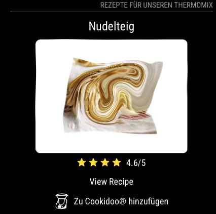

# MMM-Cookidoo

MMM-Cookidoo is a MagicMirror² module that fetches and displays random recipes from [rezeptwelt.de](https://www.rezeptwelt.de/rezepte/rezeptedestages/liste). It rotates through the recipes, showing details like the title, image, and rating. The module also provides clickable links for viewing the full recipe and for adding the recipe to Cookidoo. Additionally, it supports notifications to trigger virtual clicks on these links.



## Today's Modifications
 - added QR codes for Cookidoo link
 - Inline QR Code Display and QR Code Modal Pop-Up

Users have three ways to access the Cookidoo link:
  1. **Clickable link** – opens in a new tab.
  2. **Inline QR code** – visible next to the link (size controlled by `qrSize`).
  3. **Modal QR code** – a larger QR code pops up automatically for scanning on mobile devices.

And finally the link is stored in the module folder to use shortcut on the smartphone to open the link and add it to your recipe library.

## Features

- **Recipe Fetching:** Scrapes recipes from rezeptwelt.de using Axios and Cheerio.
- **Auto-Rotation:** Rotates the displayed recipe every 10 seconds.
- **Periodic Updates:** Refreshes the recipe list every hour.
- **Display Elements:** Shows the recipe title, image, and rating (with star icons via Iconify).
- **Interactive Links:** Provides a "View Recipe" link and a "Zu Cookidoo hinzufügen" link.
- **Add to Cookidoo QR-Code:** The Cookidoo link is now wrapped together with an inline QR code in the module's main view.
- **Store Cookidoo Link:** The cookidoo link is stored in `~/MagicMirror/modules/MMM-Cookidoo/cookidoo.link` on each DOM update. Used to get the link without any external module (solution works at least for Apple devices)!
- **Notification Handling:** Listens for `Cookidoo_view`, `Cookidoo_view_close` and `Cookidoo_add` notifications to simulate virtual clicks on the respective links.

## Installation

1. **Clone the Repository:**

   Navigate to your MagicMirror `modules` directory and clone the repository:

   ```
   cd ~/MagicMirror/modules
   git clone https://github.com/ChrisF1976/MMM-Cookidoo.git
   ```

2. **Install Dependencies:**

```
cd MMM-Cookidoo
npm install
```
## Update

   ```
   cd ~/MagicMirror/modules/MMM-Cookidoo
   git pull
   npm ci
   ```


## Configuration

To configure the module, add it to your MagicMirror `config/config.js` file:
```
{
  module: "MMM-Cookidoo",
  position: "top_right",  // Adjust position as needed
  config: {
    updateInterval: 60 * 60 * 1000,  // Update recipes every 1 hour
    rotateInterval: 5 * 60 * 1000,   // Rotate displayed recipe every 5 minutes
    apiURL: "https://www.rezeptwelt.de/rezepte/rezeptedestages/liste",
    imageWidth: "250px",            // Recipe image width (e.g., "250px" or "100%")
    showRecipeLink: true,           // Display "View Recipe" link
    showCookidoo: true,             // Display the Cookidoo container link
    showRating: true,               // Display the rating with stars
    moduleWidth: "400px",           // Module width (applied to outer wrapper)
    showQR: true,                   // If true, display an inline QR-code next to the Cookidoo link.
    qrSize: "50x50"                 // Size for the inline QR-code (e.g., "50x50"). Try with your smartphone.
  }
},
```


## Interactive Notifications:
The module listens for the following notifications:
- `Cookidoo_view`: Simulates a click on the "View Recipe" link and opens it as a seperate window overlay.
- `Cookidoo_view_close`: Close the window overlay again.
- `Cookidoo_add`: Simulates a click on the Cookidoo container link.
- Users have three ways to access the Cookidoo link:
  1. **Clickable link** – opens in a new tab.
  2. **Inline QR code** – visible next to the link (size controlled by `qrSize`).
  3. **Modal QR code** – a larger QR code pops up automatically for scanning on mobile devices.
To trigger these notifications from another module or custom script, use:
```
this.sendNotification("Cookidoo_view");
// or
this.sendNotification("Cookidoo_view_close");
// or
this.sendNotification("Cookidoo_add");
```
## Use a shortcut to the cookidoo-link
The cookidoo link is stored in `~/MagicMirror/modules/MMM-Cookidoo/cookidoo.link`. Now you can also create a shortcut on your mobile device to get the cookidoo link.
   **This solution works with Apple devices. I dont know if Android supports that, too.**
1. Open the Shortcuts App
   Open the Shortcuts app on your iPhone or iPad.
2. Create a New Shortcut
   Tap the “+” button to create a new shortcut.
   Tap “Add Action.”
3. Add the “Run Script Over SSH” Action
   - In the search bar at the bottom, type “SSH” and select Run Script Over SSH.
   - In the Run Script Over SSH action, configure the following fields:
      - Host: Enter your MagicMirror’s IP address (for example, 192.168.1.100).
      - User: Enter the username used to log into your mirror (e.g., pi if you're using a Raspberry Pi).
      - Port: Leave it at the default (usually 22) unless your mirror uses a different port.
      - Password/Key: Choose the appropriate authentication method (enter your password or select your private key if you use key-based authentication).
      - In the Script field, enter the command to output the file’s contents. For example:
         - `cat ~/MagicMirror/modules/MMM-Cookidoo/cookidoo.link`
      Note: Adjust the file path if your MagicMirror installation is in a different location.
4. Add the get URL
5. Add open URL
6. Run the shortcut.

## Files

- **MMM-Cookidoo.js**  
  The main frontend module file which handles displaying the recipes and listening to notifications.

- **node_helper.js**  
  The backend helper which scrapes recipes from the website using Axios and Cheerio.

- **MMM-Cookidoo.css**  
  The stylesheet for customizing the look of the module.

- **package.json**  
  Lists dependencies (axios and cheerio) and other project metadata.

## License

This project is licensed under the MIT License.

## Author

ChrisF1976
